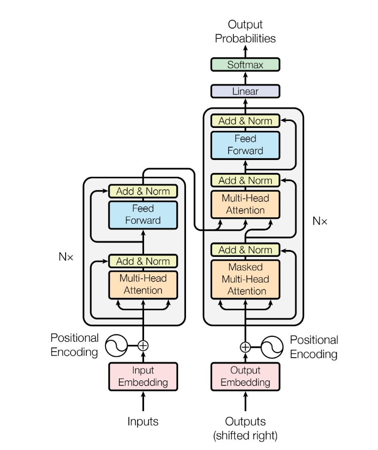

# Transformer from scratch

This is the pytorch version of implmenting transformer from scratch

Transformer is a powerful sequence transduction model , and we here implement every detail of it. And we trained my model to be capable of translating 
from English to Chinese.

> TODO:
> <li> - [ ] Preprocess the EN-ZH Dataset 
> <li> - [ ] Construct the training part of the transformer
> <li> - [ ] Optimize the hyperparameters to obtain the best model
> <li> - [ ] Add interface that we can use to do the translation

## Architecture of Transformer

**Overall architecture of the model:**

&emsp;Transformer is an encoder-decoder structure like this

